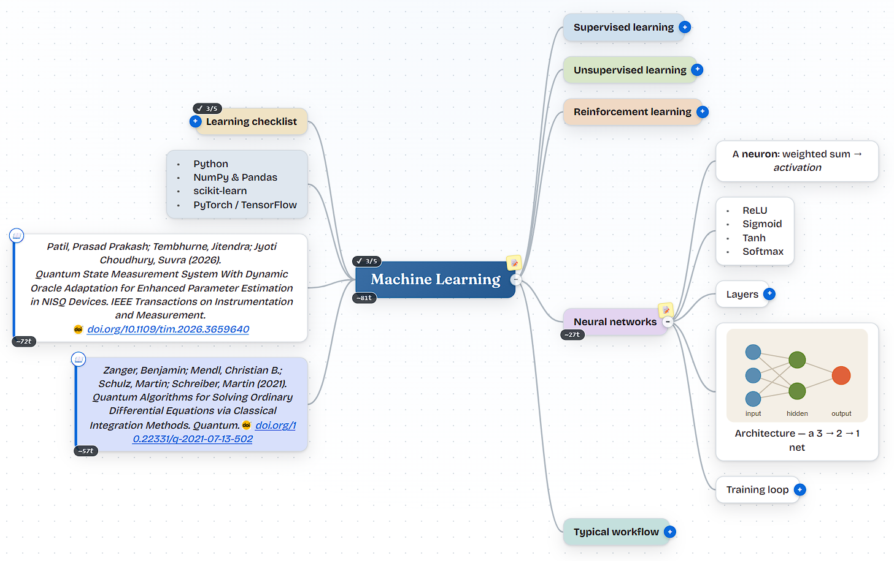

# MindSpark

An open-source, self-hostable **mind mapping app** with a database backend — inspired by GitMind, but with **no accounts, no paywalls, no feature gates, and no usage limits**. It's yours to run, modify, and extend.

  

**▶ Try it live → [mindspark.githubpage.workers.dev](https://mindspark.githubpage.workers.dev/)** — runs entirely in your browser. Sign in with GitHub and your maps are saved as private JSON files in a `mindspark-maps` repo on your own account (no server in between).

<p align="center">
  
</p>

## Features

- **Infinite canvas** with smooth pan & zoom, fit-to-screen
- **Keyboard-first editing** — `Tab` for child, `Enter` for sibling, `F2` to rename, `Del` to remove, start typing to edit
- **Live auto-layout** — the tree tidies itself as you type, so a growing node never overlaps its neighbours
- **Drag-and-drop reordering** — drop a topic on another's centre to nest it, or on its top/bottom edge to insert it between siblings and reorder
- **Layout options** — Balanced (split left/right), Right, **Left**, or Down (org-chart)
- **Math** — write `$...$` (inline) or `$$...$$` (display) LaTeX and it renders as native **MathML**; equations also render in PNG exports. Zero dependencies — covers the common inline subset (sub/superscripts, Greek, operators, `\frac`, `\sqrt`, accents, fonts, function names)
- **Prompt building** — *Compile subtree → prompt*: assemble any branch into a prompt, substitute `{{variables}}`, see the token estimate, then copy or run it
- **Version history** — browse, **diff** (added / removed / edited nodes), preview, and restore past versions
- **Rich text & nodes** — bold/italic/underline, lists, links, notes, images, citations, task progress
- **Color themes** per node + per map, incl. **GitHub Light** and other light/dark themes
- **Undo / redo** (full history) · **search & highlight** · **presentation mode**
- **Multiple maps** with a clickable sidebar; create, rename, duplicate, delete
- **Auto-save** to your database (or to a private GitHub repo in cloud mode)
- **Import** JSON, OPML, Markdown, GitMind (`.gmind`) and MindMeister (`.mind`) files
- **Export** to PNG, JSON, Markdown/text, Word (`.doc`), Mermaid, a references list, or a prompt
- **Database persistence** — every map is stored in SQLite
- **Zero dependencies** — runs on a bare Node.js install, even offline

## Creating a map

Press **`Tab`** to add a child topic and **`Enter`** to add a sibling — the tree auto-arranges into a balanced layout as you go. New sign-ins start with the **“ML - Overview (Demo)”** sample above so there's something to explore right away.
<!-- 
<p align="center">
  
</p>
-->
## Quick start

Requires **Node.js ≥ 22** (for the built-in SQLite + HTTP — no packages to install).

```bash
node server.js
# → http://localhost:3000
```

That's it. No build step, no `npm install`, no native compilation. A SQLite database file is created automatically at `./data/mindspark.db`.

Optionally, via npm (just runs the same command, but silences the experimental-SQLite notice):

```bash
npm start
```

## Configuration

All optional, set as environment variables:

| Variable  | Default                  | Description                |
|-----------|--------------------------|----------------------------|
| `PORT`    | `3000`                   | HTTP port                  |
| `DB_PATH` | `./data/mindspark.db`    | SQLite database file path  |
| `PUBLIC`  | `./public`               | Static frontend directory  |

Example:

```bash
PORT=8080 DB_PATH=/var/lib/mindspark/db.sqlite node server.js
```

## Two deployment modes — pick one

MindSpark detects how it's running and picks a storage backend automatically:

| Mode | How to run | Auth | Storage | Cost | Use this when |
|---|---|---|---|---|---|
| **Self-hosted** | `node server.js` | None — single user | SQLite on disk | Whatever your server costs | Personal use, LAN, behind your own auth |
| **Cloud (static)** | Deploy the `public/` folder to any static host | GitHub Personal Access Token | The user's own private `mindspark-maps` GitHub repo | **$0** | Free public hosting, multi-user (each user → their own GitHub) |

The same code runs both ways. The client probes `/healthz` at boot — if it answers, it's the self-hosted server; otherwise it falls back to GitHub-backed cloud mode and shows a sign-in screen.

## Cloud (static-only) deployment — $0 forever

Pure browser app, talks directly to the GitHub API. Each visitor stores their own maps in their own private repository. There is **no backend to maintain**.

### Deploy to GitHub Pages

1. Push this repo to GitHub.
2. **Settings → Pages → Build & deployment**: set source to **Deploy from a branch**, branch `main` (or `master`), folder `/public`.
3. Open `https://<your-username>.github.io/<repo-name>/` — the sign-in screen appears.

### Deploy to Cloudflare Pages / Netlify / Vercel

Any static host works. Just point it at the `public/` directory. No build step needed.

```text
Build command:     (none)
Output directory:  public
```

### User flow (per visitor)

1. Click **"Create a personal access token on GitHub →"** in the sign-in screen.
2. GitHub opens with the form pre-filled (description=MindSpark, scope=`repo`). Click **Generate token**.
3. Paste the token into MindSpark and click **Sign in**.
4. On first sign-in, MindSpark creates a **private** repo called `mindspark-maps` in the user's GitHub account. Every save commits a small JSON file there.

The token is stored only in `localStorage` on the user's device. It's sent only to `api.github.com`. To revoke: <https://github.com/settings/tokens>.

### Why a PAT instead of "Sign in with GitHub"?

A clean OAuth button would require a backend (a small Cloudflare Worker or Netlify Function) to handle the `client_secret` exchange. The PAT approach keeps the architecture **purely static** — zero servers, zero ops, zero ongoing cost. If you later want the polished one-click OAuth UX, add a tiny serverless function that swaps an OAuth code for a token; the rest of the code keeps working unchanged.

## Self-hosted deployment

**Any VPS / bare metal**

```bash
git clone <your-repo> mindspark && cd mindspark
PORT=80 node server.js
# behind a reverse proxy (nginx/Caddy) for TLS in production
```

**Docker**

```bash
docker build -t mindspark .
docker run -p 3000:3000 -v mindspark-data:/app/data mindspark
```

**Keep it running** with a process manager (systemd, pm2, etc.). A sample systemd unit:

```ini
[Service]
ExecStart=/usr/bin/node /opt/mindspark/server.js
Environment=PORT=3000
Restart=always
WorkingDirectory=/opt/mindspark
```


## API

A plain REST API — build other clients, scripts, or integrations on top of it.

| Method   | Path             | Description                          |
|----------|------------------|--------------------------------------|
| `GET`    | `/api/maps`      | List all maps (id, title, color)     |
| `GET`    | `/api/maps/:id`  | Get one full map (nodes + structure) |
| `POST`   | `/api/maps`      | Create a map (body = map JSON)       |
| `PUT`    | `/api/maps/:id`  | Update / upsert a map                |
| `DELETE` | `/api/maps/:id`  | Delete a map                         |
| `GET`    | `/healthz`       | Health check                         |

A "map" is JSON shaped like:

```json
{
  "id": "abc123",
  "title": "My Map",
  "color": "#e0613a",
  "rootId": "r1",
  "nodes": {
    "r1": { "id": "r1", "text": "Central Idea", "parent": null, "x": 0, "y": 0, "side": "root" },
    "n2": { "id": "n2", "text": "Branch",       "parent": "r1", "side": "right", "color": "#dcefce" }
  }
}
```

## Using a different database

The data layer lives entirely in `server.js` (the `Q` prepared statements and `upsert()` helper). To switch to **PostgreSQL / MySQL**, replace those with your driver's queries — the table is just `(id, title, color, data, updated)` where `data` is the full map JSON. Nothing else in the app needs to change.

## Project layout

```
mindspark/
├── server.js          # zero-dependency HTTP + SQLite API server
├── package.json
├── Dockerfile
├── public/
│   ├── index.html     # app shell
│   ├── styles.css     # all styling
│   └── app.js         # the full mind-map editor (vanilla JS)
└── data/              # created at runtime — your SQLite database
```

## License

MIT — do anything you want with it. No restrictions.
